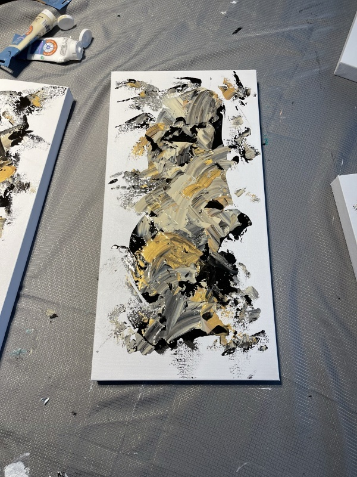

# Art Segmentation

<p align="center">
  
  
  
</p>
<p align="center">
     
     
    
</p>

<p align="center">
     
     
    
</p>

<p align="center">
     
     
    
</p>
<p align="center">
     
     
    
</p>

Download weights from Google Drive
```bash
    gdown --id 1EDUARyROWS1yUbqTcZ0AhJ7K-31M9MZk
    unzip weight.zip
```
Manually from ```bash https://drive.google.com/file/d/1EDUARyROWS1yUbqTcZ0AhJ7K-31M9MZk/view?usp=drive_link ```

## Install Required Dependencies
Create Virtual Environment
```bash
    conda create --name artdetector python=3.8
    conda activate artdetector
```

Install Dependencies
```bash
    pip install -r requirements.txt
```

Run Flask program
```bash
    python application.py
```

Run Browser to test segmentation
```
 http://127.0.0.1:5000
```

Choose your image and click the Upload button <br>
Wait until you get the segmented output

Click the ReTake Button to test new images

## API 
URL: http://127.0.0.1:5000/detectart

OPEN POSTMAN:
POST body

```bash
    {
        "image":"<base64 image>"
    }
```

## Run Docker 
```bash
    docker build -t <your_tag> .
    docker container run -p 5001:5000 <your_tag>
```


# Deploying Art Detector AI Engine in Elastic BeanStalk

## Make .zip folder with following hierachy
```bash

Flask app.
│   application.py
│   src
│   README.md
│   requirements.txt
│
├───.ebextensions
│       packages.config
│       python.config
│
├───.platform
│   └───nginx
│       └───conf.d
│               upload_size.conf
│
├───templates
│       index.html
│       output.html
|───weights
```

NOTE: The name of your main flask app must be **application.py**

### Install required packages in Elastic BeanStalk Environment
1) Create a folder name **.ebextensions**
2) Create file packages.config name and paste the following lines

```bash
commands:
    install_mesa:
        command: yum install mesa-libGL -y
```
The above command install libGL library which is required for OpenCV and rembg

3) Create file python.config
```bash
option_settings:
  "aws:elasticbeanstalk:container:python":
    WSGIPath: application:application
```
4) Create folder name **.platform/nginx/conf.d** and file **.platform/nginx/conf.d/upload_size.conf**
```bash
client_max_body_size 20M;
proxy_read_timeout 3000;
proxy_connect_timeout 3000;
proxy_send_timeout 3000;
```
client_max_body_size: <Set the maximum size of body to request>
proxy_read_timeout: <Set maximum request read timeout>
proxy_connect_timeout: <Set maximum connection timeout>
proxy_send_timeout: <Set maximum response send timeout>


## Create Elastic BeanStalk Application

1) Open Elastic BeanStalk
2) Click **Create environment**
Fill Following Information:

Application Information
    Application name: Artdetector

Platform
    platform: Python 
    platform branch: Python 3.8
    platform version: 3.5.3

Application code 
    Upload your code 
    Version label: ver-1
    Local file: Upload application (Choose File)

Presents:
    Single instance

Click Next

3) Service role:
    - Create and use new service role

EC2 key pair:
    - Select your keys

EC2 instance profile:
    - <create IAM role>


Create role with name: aws-elasticbeanstalk-ec2-role
Goto: IAM > Roles > Create role
Add Permission details:
```bash
    AWSElasticBeanstalkEnhancedHealth
    AdministratorAccess-AWSElasticBeanstalk
    AWSElasticBeanstalkManagedUpdatesCustomerRolePolicy
```

Click Next

4) Configure instance traffic and scaling

Instance settings:
    Public IP address:
        tick: Activated

Click Next

Add EC2 Security groups:
    Enable Port 5000 - 5005


Auto scaling group:
    Select your environment type:
        Single Instance or Load Balance

    Select instance t3.x2large, t3.xlarge

Click Next

5) Configure updates, monitoring, and logging
    Rolling updates and deployments:
        Command timeout: 3500

Click Next

6) Submit
